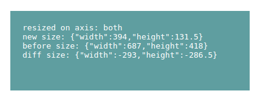

# jquery-resize

By default, the resize event is fired on the window element. This small plugin fires the resize event with additional information on all elements.



## Setup
```js 
$.setupResize.setDefaults({
    debug: true, // Default false, If debug is true, the content of the element is replaced with the return parameters.
    wait: 0 // Default 100ms, when changing the size, how long should you wait until the event is triggered?
});
```
## Calling up the plugin

```js
$('div').resize();

$('div').on('resize', function(e,axis, afterSizes, beforeSizes, diffSizes){
    console.log(axis, afterSizes, beforeSizes, diffSizes);
    // console output: 'x', {width: 934, height: 665}, {width: 985, height: 665}, {width: -51, height: 0}
});

// or directly with callback function

$('div').resize((axis, afterSizes, beforeSizes, diffSizes) => {
    console.log(axis, afterSizes, beforeSizes, diffSizes);
    // console output: 'x', {width: 934, height: 665}, {width: 985, height: 665}, {width: -51, height: 0}
});
```