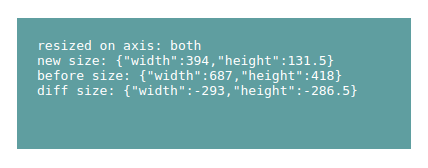

# jQuery Resize Plugin

[](composer.json)
[](https://jquery.com/)

A lightweight jQuery plugin that adds a robust `resize` event to **any** HTML element using `ResizeObserver`. Unlike the native window resize event, this plugin tracks size changes of individual elements and provides detailed information about the change.



## Features

- **Element-level resize tracking**: Monitor any element, not just the `window`.
- **Detailed change data**: Get the axis of change (`x`, `y`, or `both`), new dimensions, previous dimensions, and the calculated difference.
- **Debouncing**: Built-in support for debouncing to prevent performance issues during rapid resizing.
- **Debug Mode**: Optional visual feedback directly within the element for easier development.
- **Flexible API**: Support for both event listeners and direct callback functions.
- **Manual Triggering**: Ability to manually trigger a resize check.

## Installation

Include jQuery and the plugin in your project:

```html
<script src="path/to/jquery.min.js"></script>
<script src="dist/jquery-resize.min.js"></script>
```

Or via Composer:

```bash
composer require webcito/jquery-resize
```

## Usage

### Basic Initialization

Initialize the plugin on your elements:

```javascript
$('.my-element').resize();
```

### With Event Listener

The plugin triggers a standard jQuery `resize` event but passes additional arguments to the handler:

```javascript
$('.my-element').on('resize', function(event, axis, afterSizes, beforeSizes, diffSizes) {
    console.log('Resize axis:', axis); // 'x', 'y', or 'both'
    console.log('New size:', afterSizes); // { width: 100, height: 100 }
    console.log('Old size:', beforeSizes); // { width: 90, height: 100 }
    console.log('Difference:', diffSizes); // { width: 10, height: 0 }
});
```

### With Callback Function

You can pass a callback directly to the `.resize()` method:

```javascript
$('.my-element').resize(function(axis, afterSizes, beforeSizes, diffSizes) {
    console.log('Resized on axis:', axis);
});
```

### Configuration Options

You can pass an options object to the initialization:

```javascript
$('.my-element').resize({
    wait: 300,   // Debounce wait time in milliseconds (default: 400)
    debug: true  // Show dimension info inside the element (default: false)
});
```

## Global Configuration

Set default values for all future initializations:

```javascript
$.setupResize.setDefaults({
    wait: 200,
    debug: false
});
```

## Manual Trigger

Force a resize calculation and event trigger:

```javascript
$('.my-element').resize('resize');
```

## API Reference

### Arguments for Event/Callback

| Argument | Type | Description |
| --- | --- | --- |
| `axis` | `string` | The axis that changed: `'x'`, `'y'`, or `'both'`. |
| `afterSizes` | `object` | The new dimensions: `{ width: number, height: number }`. |
| `beforeSizes` | `object` | The dimensions before the resize: `{ width: number, height: number }`. |
| `diffSizes` | `object` | The difference between new and old sizes: `{ width: number, height: number }`. |

### Options

| Option | Type | Default | Description |
| --- | --- | --- | --- |
| `wait` | `number` | `400` | Debounce time in milliseconds. |
| `debug` | `boolean` | `false` | If true, overlays resize info on the element. |

## Requirements

- jQuery 3.0 or higher
- Modern browser with `ResizeObserver` support (Chrome 64+, Firefox 69+, Safari 13.1+, Edge 79+)

## License

This project is licensed under the proprietary License - see the composer.json file for details.
